---

title: ChurnGuard ML Platform
emoji: 📉
colorFrom: blue
colorTo: purple
sdk: streamlit
sdk_version: "1.32.2"
app_file: app/app.py
pinned: false
-------------

# 📉 ChurnGuard — Real-Time Customer Churn Intelligence Platform

### End-to-End Machine Learning System • Explainable AI • Customer Segmentation • NLP • Deep Learning

**Author:** K. Siddhartha
🔗 GitHub: [https://github.com/k-siddhartha-ai](https://github.com/k-siddhartha-ai)
🔗 LinkedIn: [http://www.linkedin.com/in/karne-siddhartha-163bb1369](http://www.linkedin.com/in/karne-siddhartha-163bb1369)

ChurnGuard is a production-style machine learning platform built to predict customer churn, analyze behavioral risk, and provide business-ready intelligence dashboards. The system demonstrates real industry engineering practices including robust preprocessing pipelines, explainability (XAI), clustering, NLP integration, and deployment-aware architecture.

---

## 📸 Demo Preview — Platform Interface

### 📂 Batch Prediction Dashboard

### 📊 EDA & Visualization Dashboard

### 🧠 Explainability & Feature Importance

### 👥 Customer Segmentation (K-Means)

---

## 📌 Business Problem

Customer churn occurs when customers discontinue a company’s services.
In subscription-driven businesses, acquiring a new customer costs **5–7× more** than retaining an existing one.

**ChurnGuard** predicts high-risk customers using historical behavioral and billing data, enabling organizations to take proactive, data-driven retention actions before revenue loss occurs.

---

## 🎯 Project Objectives

* Predict customer churn using supervised machine learning
* Identify churn-driving behavioral patterns
* Segment customers using unsupervised learning
* Build a **modular, production-style ML pipeline**
* Deploy a **real-time inference dashboard**

---

## 📊 Dataset

**IBM Telco Customer Churn Dataset**

Each record represents a customer with:

* Demographic information
* Subscription & contract details
* Service usage patterns
* Billing and payment behavior

**Target Variable:** `Churn (Yes / No)`

---

## 🧠 End-to-End Machine Learning Pipeline

### System Architecture

---

## 🔧 Training Pipeline (Offline)

The training pipeline follows a reproducible workflow designed to prevent data leakage and ensure deployment consistency.

### Steps

1. **Data Ingestion**

   * Load raw Telco churn dataset
   * Handle encoding and malformed rows

2. **Schema Validation**

   * Verify required features
   * Separate target variable
   * Enforce correct datatypes

3. **Data Cleaning**

   * Handle missing values
   * Convert numeric fields safely
   * Normalize categorical values

4. **Feature Engineering**

   * ColumnTransformer preprocessing pipeline
   * One-hot encoding for categorical variables
   * Scaling for numerical features
   * Ensures identical preprocessing during inference

5. **Model Training**

   * Logistic Regression (interpretable baseline)
   * Random Forest (non-linear ensemble)
   * KMeans clustering for segmentation

6. **Model Evaluation**

   * ROC-AUC
   * Precision, Recall, F1-score
   * Metrics selected for churn class imbalance

7. **Model Persistence**

   * Full pipelines serialized using `joblib`
   * Stored as reusable inference artifacts

---

## 🌐 Real-Time Inference Pipeline

Designed for robust real-world usage and schema-safe predictions.

1. Upload CSV or Excel files via Streamlit UI
2. Automatic schema alignment with training features
3. Missing categorical values handled safely
4. Missing numeric values defaulted to 0
5. Prediction generation with probability scores
6. Risk Segmentation:

   * High Risk (≥70%)
   * Medium Risk (40–69%)
   * Low Risk (<40%)
7. Explainability dashboards and downloadable reports

---

## 🧪 Models Used

* **Logistic Regression** — highly interpretable baseline model
* **Random Forest Classifier** — captures complex feature interactions
* **KMeans Clustering** — customer segmentation and profiling

### 🤔 Why These Models?

**Logistic Regression**

* Clear business interpretability
* Odds-ratio based explanations
* Suitable for regulated environments

**Random Forest**

* Handles non-linear relationships
* Improves churn recall
* Robust against noisy features

### Why Deep Learning is not Primary Model?

Tabular churn datasets typically favor tree-based models.
Deep learning is included to demonstrate architectural knowledge rather than being the default production choice.

---

## 📈 Evaluation Metrics & Rationale

* **Recall (Churn Class):** Avoid missing high-risk customers
* **ROC-AUC:** Measures ranking performance
* **F1-Score:** Balances precision and recall
* **Precision:** Controls unnecessary retention costs

Metrics reflect real business trade-offs instead of raw accuracy.

---

## 🌐 Deployment Architecture

Streamlit Frontend + FastAPI Backend.

⚠️ Some modules are intentionally limited on Hugging Face Spaces due to environment constraints:

* Single-customer API inference
* Transformer NLP runtime limits
* Deep learning inference separation

These limitations reflect real production deployment scenarios.

---

## 🤖 Deep Learning Module

A dense neural network model was trained offline:

* Architecture: Dense NN (64 → 32 → 1)
* Activation: ReLU + Sigmoid
* Optimizer: Adam
* Loss: Binary Cross-Entropy

Inference disabled in demo due to TensorFlow environment differences — demonstrating deployment awareness.

---

## 🛠 Tech Stack

Python • Pandas • NumPy • Scikit-learn • Streamlit • FastAPI • Joblib • Matplotlib • Seaborn

---

## ▶️ How to Run Locally

pip install -r requirements.txt
uvicorn main:app --reload
streamlit run app/app.py

Open: [http://localhost:8501](http://localhost:8501)

---

## 📁 Project Structure

churnguard/
├── config/
├── data/
├── docs/
├── src/
├── pipelines/
├── app/
├── artifacts/
├── run.py
├── requirements.txt
└── README.md

---

## 🚀 Results & Business Impact

* Identifies high-risk churn customers before attrition
* Enables targeted retention strategies
* Reduces potential revenue loss
* Demonstrates industry-grade ML system design

---

## 🧠 What This Project Demonstrates

* End-to-end ML engineering
* Data leakage prevention
* Explainable AI (XAI)
* Deployment-aware system design
* Realistic production constraints

---

## 📬 Contact

GitHub: [https://github.com/k-siddhartha-ai](https://github.com/k-siddhartha-ai)
LinkedIn: [http://www.linkedin.com/in/karne-siddhartha-163bb1369](http://www.linkedin.com/in/karne-siddhartha-163bb1369)
